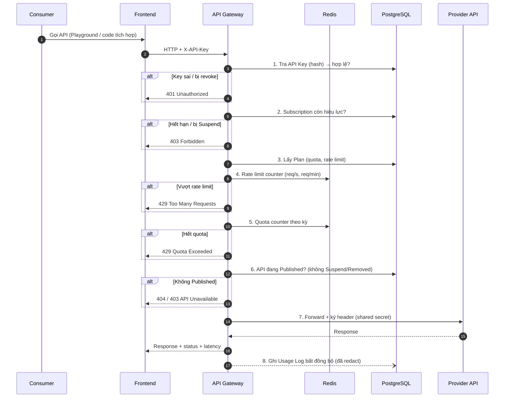
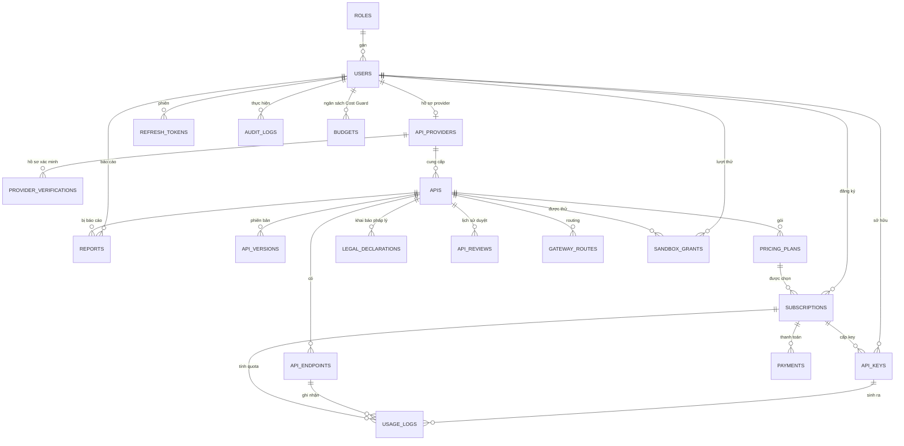
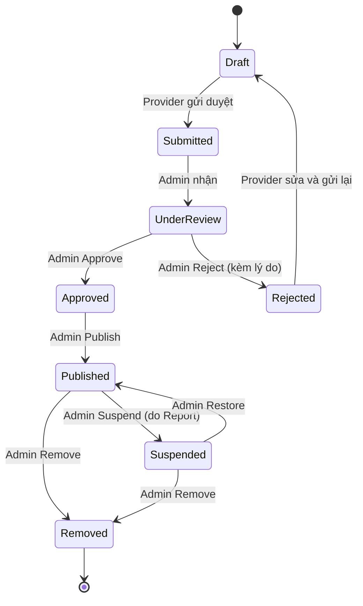

# 01 — Kiến trúc hệ thống API Marketplace & Management

> Nguồn: `Nhóm LLM (1).pdf` (22 trang) + `Product_Backlog_5_Sprint.xlsx`
> Phạm vi: MVP 5 sprint (05/10 → 15/11), 48 mục backlog, 260 điểm effort.

---

## 1. Sản phẩm là gì

Nền tảng web cho phép **nhà phát triển đăng tải, quản lý, chia sẻ và thương mại hóa API**, đồng thời cho phép **người dùng tìm kiếm, dùng thử, đăng ký và theo dõi việc sử dụng API** theo gói Free/Paid.

Sản phẩm không phải một website CRUD đăng/mua API, mà giải quyết trọn vòng đời:

**Consumer:** Tìm → Đánh giá → So sánh → Test → Đăng ký → Tích hợp → Theo dõi → Quản lý quota/chi phí

**Provider:** Đăng API → Tạo documentation → Thiết lập Free/Paid → Phân phối → Quản lý người dùng → Theo dõi chất lượng → Theo dõi usage/doanh thu

### 1.1 Vision (theo PDF)

| Thành phần | Nội dung |
|---|---|
| **FOR** | Sinh viên CNTT, lập trình viên, freelancer, startup, doanh nghiệp công nghệ |
| **WHO** | Phải tìm API nhiều nguồn, docs không đồng nhất, khó đánh giá chất lượng, khó quản lý key/quota/chi phí |
| **THE PRODUCT** | Nền tảng API Marketplace & Management |
| **THAT** | Một nền tảng duy nhất cho toàn bộ vòng đời sử dụng API |
| **UNLIKE** | Marketplace + API Management + Playground + Analytics + Subscription trong **một** hệ thống |
| **OUR PRODUCT** | Tìm → Test → Đăng ký → Tích hợp → Theo dõi, liền mạch |

### 1.2 Ràng buộc pháp lý & phạm vi (PDF mục 8)

- Provider chỉ được cung cấp API **mình sở hữu** hoặc **có quyền hợp pháp phân phối**.
- Trước khi công khai: Provider phải **được xác minh**, **khai báo nguồn gốc**, **khai báo loại dữ liệu**, **chấp nhận Provider Agreement**.
- API liên quan dữ liệu cá nhân / lĩnh vực có điều kiện → **kiểm duyệt bổ sung**.
- Platform là **trung gian**: quản lý Marketplace, Gateway, Subscription, Usage; cung cấp cơ chế báo cáo, tạm khóa, gỡ API vi phạm.
- **Không xử lý thanh toán thật** — chỉ Payment Sandbox. Ưu tiên API do nhóm tự xây / API demo / API có quyền sử dụng rõ ràng.

---

## 2. Tech stack chốt

| Lớp | Công nghệ | Ghi chú |
|---|---|---|
| Frontend | React + TypeScript + Vite | SPA, route guard theo vai trò |
| Backend | Node.js + TypeScript + Express 5 | REST API, Swagger/OpenAPI |
| Gateway | Express 5 (service riêng) | Control Plane tách khỏi Data Plane |
| Database | PostgreSQL | Dữ liệu lâu dài, transaction, aggregate |
| Cache/Counter | Redis | Rate limit, quota counter, sandbox counter |
| ORM/Query | Knex hoặc node-postgres (pg) | Migration bằng SQL thuần trong `migrations/` |
| Auth | JWT (access) + Refresh Token (rotating, hash trong DB) | RBAC theo role |
| Container | Docker + Docker Compose | FE–BE–DB–Redis bằng 1 lệnh |
| CI/CD | GitHub Actions | Đã có `.github/workflows/ci.yml` |
| Test | Jest/Vitest (unit) + Supertest (integration) | QA dùng test case thủ công + Postman |

> **Lưu ý:** repo hiện đã có `migrations/001_create_auth_schema.sql` với role `ADMIN / USER / API_PROVIDER`. Tài liệu này **giữ nguyên** 3 role đó và ánh xạ `USER` → **Consumer** (xem [02-role-va-phan-quyen.md](./02-role-va-phan-quyen.md)).

---

## 3. Kiến trúc tổng thể: Control Plane – Data Plane – Background Worker

Đây là kiến trúc đã được chốt trong backlog **EN-01** ("Chốt kiến trúc Control Plane – Data Plane – Background Worker").

```mermaid
flowchart TB
    subgraph Client["Client Layer"]
        C1["Consumer Browser"]
        C2["Provider Browser"]
        C3["Admin Browser"]
    end

    subgraph FE["Frontend SPA - React + TS"]
        F1["Marketplace / API Detail"]
        F2["Playground"]
        F3["Provider Dashboard"]
        F4["Consumer Dashboard"]
        F5["Admin Console"]
    end

    subgraph CP["CONTROL PLANE - Backend API :3000"]
        A1["Auth & RBAC"]
        A2["User / Profile"]
        A3["Provider Onboarding & Compliance"]
        A4["API Publishing & Documentation"]
        A5["Pricing Plan"]
        A6["API Key Service"]
        A7["Subscription & Payment Sandbox"]
        A8["Review / Moderation / Audit Log"]
        A9["Analytics & Cost Guard"]
    end

    subgraph DP["DATA PLANE - API Gateway :4000"]
        G1["Routing Registry"]
        G2["API Key Verify"]
        G3["Subscription / Plan Check"]
        G4["Rate Limit - Redis"]
        G5["Quota Guard - Redis"]
        G6["Forward + Sign Header"]
        G7["Usage Logger - async"]
    end

    subgraph WK["BACKGROUND WORKER"]
        W1["Quota Reset theo kỳ"]
        W2["Subscription Expiration"]
        W3["Usage Aggregate"]
        W4["Health Monitoring - sau MVP"]
    end

    subgraph DATA["Data Layer"]
        PG[("PostgreSQL")]
        RD[("Redis")]
    end

    subgraph EXT["External"]
        P1["Provider API - Weather"]
        P2["Provider API - Translate"]
        P3["Provider API - Currency"]
        PS["Payment Sandbox"]
    end

    C1 --> F1
    C1 --> F2
    C1 --> F4
    C2 --> F3
    C3 --> F5

    F1 --> A4
    F2 --> G1
    F3 --> A4
    F4 --> A9
    F5 --> A8

    A1 --> PG
    A2 --> PG
    A3 --> PG
    A4 --> PG
    A5 --> PG
    A6 --> PG
    A7 --> PG
    A7 --> PS
    A8 --> PG
    A9 --> PG

    G1 --> PG
    G2 --> PG
    G3 --> PG
    G4 --> RD
    G5 --> RD
    G6 --> P1
    G6 --> P2
    G6 --> P3
    G7 --> PG

    W1 --> PG
    W1 --> RD
    W2 --> PG
    W3 --> PG
    W4 --> P1
```



### 3.1 Vì sao tách Control Plane và Data Plane

| | Control Plane (Backend API) | Data Plane (Gateway) |
|---|---|---|
| Vai trò | Quản trị, CRUD, nghiệp vụ | Chuyển tiếp request runtime |
| Tải | Thấp, không đều | Cao, liên tục, độ trễ nhạy cảm |
| Xác thực | JWT (người dùng) | API Key (máy ↔ máy) |
| Scale | Scale theo người dùng | Scale ngang theo RPS |
| Sự cố | Ảnh hưởng thao tác quản trị | Ảnh hưởng toàn bộ traffic API |

Tách ra để: (1) Gateway không bị ảnh hưởng khi Backend deploy; (2) đo được **overhead của Gateway** (yêu cầu trong US-23); (3) rate limit/quota dùng Redis không đụng DB nghiệp vụ.

### 3.2 Vì sao có Background Worker

Các việc **không được** chạy trong request path: reset quota đầu kỳ, chuyển Subscription sang `Expired`, aggregate usage cho Analytics, health check upstream. Worker chạy theo lịch (cron) và ghi vào PostgreSQL.

---

## 4. Luồng xử lý một request API (PDF mục 7)

Đây là luồng quan trọng nhất của hệ thống — **US-23** yêu cầu thứ tự kiểm tra cố định.



### 4.1 Thứ tự kiểm tra (bắt buộc)

```
API Key → Subscription → Plan → Rate Limit → Quota → Provider API
```

### 4.2 Quy tắc quan trọng

- **Quota ≠ Rate Limit** (PDF mục 5e):
  - **Quota** = tổng số request trong một kỳ (ví dụ 1.000 request/tháng).
  - **Rate Limit** = tốc độ gửi request (ví dụ 10 request/giây).
  - Một user còn nhiều quota **vẫn bị chặn** nếu gửi quá nhanh.
- **Consumer không được gọi thẳng upstream.** Gateway ký header bằng shared secret; Provider API từ chối request không có chữ ký hợp lệ.
- **Usage Log ghi bất đồng bộ** — không làm chậm request (US-24).
- **Redis ↔ PostgreSQL:** Redis giữ bộ đếm tốc độ cao; PostgreSQL giữ dữ liệu lâu dài. Cần tài liệu quy tắc **fail-open / fail-closed** khi Redis lỗi (Sprint 4, Danh).

### 4.3 Playground Proxy (US-18) — chống SSRF

Playground **không** cho phép gọi URL tùy ý. Chỉ gọi endpoint đã đăng ký trên nền tảng.

| Nguy cơ | Biện pháp |
|---|---|
| Gọi IP nội bộ / metadata endpoint | Allowlist theo routing registry; block dải private (10/8, 172.16/12, 192.168/16, 127/8, 169.254/16) |
| Redirect sang host khác | Không follow redirect, hoặc re-validate từng hop |
| DNS rebinding | Resolve DNS → kiểm tra IP → pin IP khi gọi |
| Response quá lớn | Giới hạn kích thước response |
| Upstream treo | Timeout bắt buộc |

---

## 5. Phân rã module

| # | Module | Epic | Sprint | Owner chính |
|---|---|---|---|---|
| 1 | Nền tảng & DevOps | EP00 | 1–5 | Tấn Dũng |
| 2 | Tài khoản & Phân quyền | EP01 | 1, 3 | Tùng Dương + Hải Dương |
| 3 | Provider Onboarding & Compliance | EP02 | 2 | Tùng Dương + Hải Dương |
| 4 | API Publishing & Documentation | EP03 | 2 | Tùng Dương + Hải Dương |
| 5 | Admin Review, Audit & Moderation | EP04 | 2, 3, 4 | Tấn Dũng |
| 6 | Marketplace & Discovery | EP05 | 3 | Tùng Dương + Hải Dương |
| 7 | Playground & Try Before Subscribe | EP06 | 3, 4 | Tùng Dương + Hải Dương |
| 8 | API Key Management | EP07 | 3 | Tùng Dương + Hải Dương |
| 9 | API Gateway & Usage Tracking | EP08 | 3 (khung) → 4 (đầy đủ) | Tùng Dương + Tấn Dũng |
| 10 | Pricing, Subscription & Payment Sandbox | EP09 | 4 | Tùng Dương + Hải Dương |
| 11 | Usage Dashboard, Analytics & Cost Guard | EP10 | 4, 5 | Hải Dương + Tùng Dương |
| 12 | Security, Quality & Release | EP11 | 1–5 | Vân + cả nhóm |

### 5.1 Gateway chia hai bước (quyết định quan trọng)

| Sprint | Phạm vi Gateway | Mục đích |
|---|---|---|
| **3** | Gateway **khung**: routing registry + kiểm tra API Key + chỉ forward tới API Published | Dùng chung cho Playground, tránh viết Playground proxy rồi phải viết lại |
| **4** | Gateway **đầy đủ**: + Subscription + Plan + Rate Limit + Quota + ký header + Usage Log | Enforcement thật |

---

## 6. Mô hình dữ liệu (mức khái quát)



### 6.1 Nhóm bảng theo sprint

| Sprint | Bảng | Owner |
|---|---|---|
| 1 | `roles`, `users`, `api_providers`, `refresh_tokens` | Danh |
| 2 | `provider_verifications`, `apis`, `api_endpoints`, `api_versions`, `documentations`, `pricing_plans`, `legal_declarations`, `provider_agreements`, `api_reviews`, `audit_logs` | Danh |
| 3 | `gateway_routes`, `sandbox_grants`, `api_keys`, thiết kế `usage_logs` / `request_history` | Danh |
| 4 | `subscriptions`, `payments`, `transactions`, `usage_logs`, `request_history`, bảng aggregate | Danh |
| 5 | Bảng/query aggregate cho Cost Guard & Provider Analytics | Danh |

### 6.2 Trạng thái API (state machine — US-12, US-13)



**Điều kiện chặn:** chỉ gửi duyệt được khi đã có đủ **documentation + pricing plan + khai báo pháp lý + chấp nhận Agreement**; chỉ Provider đã **Verified** mới tạo được API.

### 6.3 Trạng thái Provider

`Pending → Verified | Rejected` — chưa `Verified` thì **không gửi duyệt API được**.

### 6.4 Trạng thái Subscription

`Active → Cancelled | Expired | Suspended` — `Suspended`/`Expired` thì Gateway chặn **ngay lập tức**.

---

## 7. Bảo mật & bảo vệ dữ liệu nhạy cảm

### 7.1 API Key (PDF mục 5d, 5o)

- Mỗi user có **key riêng cho từng API/Subscription**, không dùng chung một key toàn hệ thống.
- **Key đầy đủ chỉ hiển thị MỘT LẦN** khi vừa tạo.
- **Database chỉ lưu hash**, không lưu plaintext.
- Thao tác: Create → Copy → Rotate → Revoke → xem Last Used.

### 7.2 Sensitive Data Redaction (US-24, PDF mục 5o)

**Không** lưu mặc định:

- API Key đầy đủ
- `Authorization` header
- Access Token
- Password
- Cookie
- Toàn bộ Request Body
- Toàn bộ Response Body có dữ liệu nhạy cảm

Ví dụ: `Authorization: ******` → `Authorization: [REDACTED]`

### 7.3 Checklist bảo mật (EN-11)

| Hạng mục | Nội dung |
|---|---|
| Phân quyền | RBAC chặn đúng 403 theo Role Matrix |
| SSRF | Playground/Gateway chặn IP nội bộ, redirect, DNS rebinding |
| Bypass | Không bypass được rate limit / quota |
| Rò rỉ log | Không còn dữ liệu nhạy cảm trong log |
| Gọi thẳng upstream | Provider API từ chối request không có chữ ký Gateway |

---

## 8. Hạ tầng, CI/CD và môi trường

### 8.1 Môi trường

| Môi trường | Mục đích | Deploy |
|---|---|---|
| `dev` | Phát triển local | `docker compose up` |
| `staging` | Test, integration, demo nội bộ | Tự động khi merge nhánh chính (EN-08) |
| `production` | Demo cuối, UAT | Sprint 5 (EN-13) |

### 8.2 CI/CD hiện có

Repo đã có `.github/workflows/ci.yml`:

- Job `phat-hien`: quét file cấu hình để phát hiện công nghệ.
- Job `nen-tang`: chạy `scripts/kiem-tra-kho-ma-nguon.ps1` — chặn dấu conflict Git, khoảng trắng cuối dòng, thiếu/rỗng `README.md` trên `main`.
- Job `node`: `npm ci` → `lint` → `test` → `build`.
- Job `ket-qua`: tổng hợp, fail nếu có job fail/cancel.

**Quy ước:** PR không qua CI thì **không được merge** (EN-05).

### 8.3 Docker Compose (EN-05)

Một lệnh dựng cả hệ thống:

```
frontend  →  :5173
backend   →  :3000
gateway   →  :4000
postgres  →  :5432
redis     →  :6379
worker    →  (không expose port)
```

---

## 9. Rủi ro kiến trúc & đối sách

| Rủi ro | Mức | Đối sách |
|---|---|---|
| Sprint 4 là điểm nóng (Gateway + Subscription + Usage dồn một sprint) | Cao | Cắt Should trước; chuyển bớt API Admin từ Backend sang Tấn Dũng (còn dư Sprint 4–5) |
| Backend/Frontend/QA sát trần năng lực (82–100%) | Cao | Gần như không còn đệm — cắt Should ngay khi trễ |
| QA chạy cuốn chiếu | Trung bình | Test song song trong từng sprint, không dồn về Sprint 5 |
| Redis lỗi → mất bộ đếm quota/rate limit | Trung bình | Tài liệu quy tắc fail-open/fail-closed (Sprint 4) |
| Overhead Gateway | Trung bình | Đo và ghi lại trong Sprint 4 (US-23) |
| Provider đăng API không thuộc quyền sở hữu | Cao | Provider Verification + Legal Declaration + Domain Verification (sau MVP) |

---

## 10. Ngoài phạm vi MVP (Sau MVP)

| Mục | Nội dung |
|---|---|
| US-33 | Domain Verification (DNS TXT / `/.well-known/`) |
| US-34 | Health Monitoring / Uptime / Latency / Error Rate |
| US-35 | API Comparison & Trust Score |
| US-36 | Notification & Activity History |
| US-37 | Xác thực email & quên mật khẩu |
| US-38 | Agreement versioning |

> Health Monitoring (US-34) **nên kéo lên Sprint 5 nếu còn dư năng lực**.

---

## 11. Tài liệu liên quan

- [02-role-va-phan-quyen.md](./02-role-va-phan-quyen.md) — Role chung cho toàn dự án & Role Matrix
- [03-quy-trinh-lam-viec.md](./03-quy-trinh-lam-viec.md) — Quy trình Git, CI/CD, Definition of Done