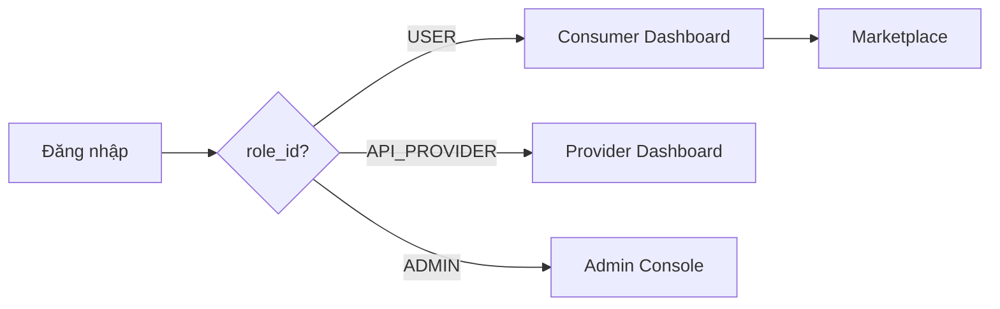

# 02 — Role chung cho toàn bộ mọi người & toàn dự án

> Tài liệu này chốt **vai trò (role)** ở hai tầng:
> **(A) Role nghiệp vụ trong hệ thống** — dùng cho RBAC, code, DB.
> **(B) Role công việc của thành viên** — dùng cho phân công, review, bàn giao.
>
> Nguồn: `Nhóm LLM (1).pdf` trang 1–2 (phân chia nhiệm vụ) + `Product_Backlog_5_Sprint.xlsx` sheet "Nhiệm vụ theo người".

---

## PHẦN A — ROLE NGHIỆP VỤ TRONG HỆ THỐNG

### A.1 Ba role chính thức

Hệ thống có **đúng 3 role**, khớp với `migrations/001_create_auth_schema.sql`:

| Role (DB) | Tên hiển thị | Mô tả | Ai dùng |
|---|---|---|---|
| `ADMIN` | Quản trị viên | Quản lý toàn bộ nền tảng: User, Provider, API, Subscription, Report, vận hành | Nội bộ nhóm |
| `USER` | **Consumer** | Người sử dụng API: tìm, thử, đăng ký, lấy key, theo dõi usage | Khách hàng chính |
| `API_PROVIDER` | **Provider** | Nhà cung cấp API: đăng, cấu hình gói, quản lý consumer & doanh thu | Khách hàng chính |

> **Quy ước quan trọng:** trong code/DB dùng `USER`, trong UI/tài liệu nghiệp vụ gọi là **Consumer**. Hai tên này là **một**. Không tạo thêm role thứ 4.

### A.2 Nguyên tắc role

1. **Một tài khoản có đúng một role** tại một thời điểm (`users.role_id` là `NOT NULL`, FK tới `roles`).
2. **Đăng ký tự chọn** Consumer hoặc Provider (US-01). **Admin không tự đăng ký** — chỉ seed sẵn.
3. **Provider là Consumer + quyền bán.** Provider vẫn có thể tìm/thử/subscribe API của Provider khác.
4. **Admin không tham gia Marketplace** với tư cách consumer — Admin chỉ quản trị.
5. **Role quyết định dashboard, menu, route và API.** Sai quyền → **403** (US-03).
6. **Role không thay thế trạng thái.** Provider `Pending` vẫn là `API_PROVIDER` nhưng **không tạo được API**; API `Draft` vẫn tồn tại nhưng **không hiện trên Marketplace**.

### A.3 Role Matrix — quyền theo chức năng

Ký hiệu: ✅ = toàn quyền · 🟡 = quyền hạn chế · ❌ = không có quyền

| # | Chức năng | Consumer (`USER`) | Provider (`API_PROVIDER`) | Admin (`ADMIN`) |
|---|---|---|---|---|
| 1 | Đăng ký / đăng nhập / đăng xuất | ✅ | ✅ | ✅ (seed) |
| 2 | Xem & sửa hồ sơ cá nhân, đổi mật khẩu | ✅ | ✅ | ✅ |
| 3 | Dashboard riêng theo vai trò | ✅ Consumer | ✅ Provider | ✅ Admin |
| 4 | Tìm / lọc / sắp xếp Marketplace | ✅ | ✅ | ❌ |
| 5 | Xem API Detail + documentation | ✅ | ✅ | 🟡 (chỉ để duyệt) |
| 6 | API Playground | ✅ | ✅ | ❌ |
| 7 | Try Before Subscribe (3–10 request/API) | ✅ | ✅ | ❌ |
| 8 | Tạo / rotate / revoke API Key | ✅ | ✅ | 🟡 (revoke khi bất thường) |
| 9 | Subscribe gói Free/Paid + thanh toán sandbox | ✅ | ✅ | ❌ |
| 10 | Quản lý / hủy / đổi gói của mình | ✅ | ✅ | ❌ |
| 11 | Usage Dashboard + Request History của mình | ✅ | ✅ | 🟡 (giám sát) |
| 12 | Cost Guard (ngân sách, cảnh báo 50/80/100%) | ✅ | ✅ | 🟡 (theo dõi cảnh báo) |
| 13 | Báo cáo API vi phạm | ✅ | ✅ | ❌ |
| 14 | Gửi hồ sơ xác minh Provider | ❌ | ✅ | ❌ |
| 15 | Tạo / sửa API, Endpoint, Version (Draft) | ❌ | ✅ (chỉ khi Verified) | ❌ |
| 16 | Upload OpenAPI → sinh documentation | ❌ | ✅ | ❌ |
| 17 | Cấu hình Pricing Plan (Free/Basic/Pro) | ❌ | ✅ | 🟡 (xem khi duyệt) |
| 18 | Khai báo pháp lý + chấp nhận Agreement | ❌ | ✅ | 🟡 (xem khi duyệt) |
| 19 | Gửi API để duyệt, theo dõi trạng thái | ❌ | ✅ | ❌ |
| 20 | Provider Dashboard (subscriber, request, doanh thu) | ❌ | ✅ | 🟡 (giám sát) |
| 21 | Provider Analytics (top endpoint, error rate, P95) | ❌ | ✅ | 🟡 (giám sát) |
| 22 | Duyệt / từ chối Provider | ❌ | ❌ | ✅ |
| 23 | Approve / Reject / Publish API | ❌ | ❌ | ✅ |
| 24 | Suspend / Restore / Remove API | ❌ | ❌ | ✅ |
| 25 | Xử lý Report & lưu lịch sử xử lý | ❌ | ❌ | ✅ |
| 26 | Quản lý User: xem, tìm, khóa/mở khóa | ❌ | ❌ | ✅ |
| 27 | Giám sát Subscription / Payment sandbox | ❌ | ❌ | ✅ |
| 28 | Suspend Subscription (hiệu lực ngay) | ❌ | ❌ | ✅ |
| 29 | Xem Audit Log | ❌ | ❌ | ✅ |
| 30 | Xem thống kê tổng thể hệ thống | ❌ | ❌ | ✅ |

### A.4 Ma trận chặn truy cập (dùng để viết test — EN-06)

| Hành vi | Kết quả mong đợi |
|---|---|
| Consumer truy cập route/API của Provider | **403** |
| Consumer truy cập route/API của Admin | **403** |
| Provider truy cập route/API của Admin | **403** |
| Provider chưa Verified gọi API tạo API | **403** |
| Provider gửi duyệt khi thiếu docs/pricing/pháp lý | **400** (kèm lý do) |
| Provider sửa API của Provider khác | **403** |
| Consumer xem API Key của Consumer khác | **403** |
| Tài khoản bị Admin khóa đăng nhập | **401/403** — không vào được |
| Gọi Gateway với key sai/bị revoke | **401** |
| Gọi Gateway khi Subscription hết hạn/bị Suspend | **403** |
| Gọi Gateway vượt rate limit | **429** |
| Gọi Gateway hết quota | **429** |
| Gọi API không Published / bị Suspend | **403/404** |
| Playground gọi URL tùy ý hoặc IP nội bộ | **400** (chặn SSRF) |
| Hết lượt Try Before Subscribe | **429** + gợi ý Subscribe |
### A.5 Ánh xạ role → không gian làm việc



---

## PHẦN C — ACCEPTANCE CRITERIA (SPRINT 1)

Dưới đây là các tiêu chí chấp nhận (AC) cho các User Story thuộc Sprint 1, dùng làm căn cứ để phát triển và kiểm thử.

### C.1 US-01: Đăng ký tài khoản (Consumer/Provider)
- **AC 1:** Người dùng có thể chọn vai trò `Consumer` hoặc `Provider` khi đăng ký.
- **AC 2:** Email phải là duy nhất (không được trùng lặp trong hệ thống).
- **AC 3:** Mật khẩu phải được mã hóa (hashing) trước khi lưu vào cơ sở dữ liệu.
- **AC 4:** Các trường bắt buộc (Email, Mật khẩu, Tên hiển thị) phải có validation ở cả FE và BE.
- **AC 5:** Sau khi đăng ký thành công, hệ thống tự động đăng nhập hoặc chuyển hướng đến trang Đăng nhập.

### C.2 US-02: Đăng nhập & Đăng xuất (JWT + Refresh Token)
- **AC 1:** Đăng nhập thành công trả về `Access Token` (ngắn hạn) và `Refresh Token` (dài hạn).
- **AC 2:** Thông tin lỗi đăng nhập (sai email/mật khẩu) phải chung chung, không được tiết lộ email có tồn tại hay không.
- **AC 3:** `Access Token` hết hạn có thể được cấp mới bằng `Refresh Token` hợp lệ mà không cần đăng nhập lại.
- **AC 4:** Khi đăng xuất, `Refresh Token` phải bị thu hồi (revoke/delete) trong Database/Redis để ngăn tái sử dụng.
- **AC 5:** Hỗ trợ cơ chế bảo mật cơ bản (ví dụ: HttpOnly Cookie cho Refresh Token).

### C.3 US-03: Phân quyền truy cập (RBAC)
- **AC 1:** Người dùng chỉ có thể truy cập các Dashboard và chức năng tương ứng với vai trò của mình (theo Role Matrix ở Phần A).
- **AC 2:** Truy cập trái phép vào các route Protected (cả FE và BE) phải trả về lỗi `403 Forbidden`.
- **AC 3:** Giao diện Dashboard phải ẩn/hiện các mục menu dựa trên quyền của người dùng.
- **AC 4:** Token không hợp lệ hoặc hết hạn khi gọi API Protected phải trả về lỗi `401 Unauthorized`.

### C.4 US-04: Admin quản lý người dùng
- **AC 1:** Admin có thể xem danh sách toàn bộ người dùng với các thông tin: Tên, Email, Vai trò, Trạng thái, Ngày tạo.
- **AC 2:** Hỗ trợ tìm kiếm người dùng theo Email hoặc Tên và phân trang danh sách.
- **AC 3:** Admin có thể Khóa (Lock) hoặc Mở khóa (Unlock) tài khoản người dùng.
- **AC 4:** Tài khoản bị khóa sẽ không thể đăng nhập và các token hiện có (nếu có) phải bị từ chối khi gọi API.

    CD --> CD2["API Detail + Playground"]
    CD --> CD3["API Key của tôi"]
    CD --> CD4["Subscription của tôi"]
    CD --> CD5["Usage + Cost Guard"]

    PD --> PD1["Hồ sơ xác minh"]
    PD --> PD2["API / Endpoint / Version"]
    PD --> PD3["Pricing Plan"]
    PD --> PD4["Khai báo pháp lý"]
    PD --> PD5["Subscriber + Doanh thu"]
    PD --> PD6["Analytics"]

    AD --> AD1["Quản lý User"]
    AD --> AD2["Duyệt Provider"]
    AD --> AD3["Duyệt / Publish API"]
    AD --> AD4["Report & Moderation"]
    AD --> AD5["Subscription / Payment"]
    AD --> AD6["Audit Log"]
```

### A.6 Gợi ý triển khai RBAC (Node.js + Express 5)

```ts
// src/middleware/require-role.ts
import type { RequestHandler } from 'express';

export type Role = 'ADMIN' | 'USER' | 'API_PROVIDER';

export const requireRole =
  (...allowed: Role[]): RequestHandler =>
  (req, res, next) => {
    const role = req.user?.role;
    if (!role || !allowed.includes(role)) {
      return res.status(403).json({
        error: { code: 'FORBIDDEN', message: 'Bạn không có quyền truy cập chức năng này.' },
      });
    }
    next();
  };
```

```ts
// Ví dụ gắn vào route
router.get('/admin/users', authenticate, requireRole('ADMIN'), listUsers);
router.post('/provider/apis', authenticate, requireRole('API_PROVIDER'), requireVerifiedProvider, createApi);
router.get('/marketplace/apis', authenticate, requireRole('USER', 'API_PROVIDER'), searchApis);
```

**Quy tắc:** mọi route nghiệp vụ **bắt buộc** có `authenticate` + `requireRole`. Route công khai duy nhất: đăng ký, đăng nhập, refresh token, health check.

---

## PHẦN B — ROLE CÔNG VIỆC CỦA THÀNH VIÊN

### B.1 Năm vai trò trong nhóm

| Thành viên | Vai trò | Trách nhiệm cốt lõi |
|---|---|---|
| **Nguyễn Tấn Dũng** | **Tech Lead / Fullstack / DevOps** | Kiến trúc tổng thể, Git & quy trình, Admin Management, tích hợp liên module, Docker/CI/CD, deploy, review code, xử lý conflict, Integration Test |
| **Nguyễn Như Tùng Dương** | **Backend Developer** | REST API, Auth/Authz, JWT/Refresh Token, API Management, Gateway, API Key, quota/rate limit, Usage Log, Subscription & Payment Sandbox, Analytics API, bảo mật Backend, unit/integration test |
| **Lê Hải Dương** | **Frontend Developer** | Kiến trúc Frontend, Marketplace, API Detail, Provider Dashboard, Playground, API Key UI, Pricing/Subscription/Checkout, Consumer Dashboard, Analytics Dashboard, Design System, state/API client/route, responsive, Frontend Testing |
| **Võ Trọng Danh** | **Database Developer** | ERD, schema toàn hệ thống, migration & seed, relationship/constraint/FK/index, transaction, tối ưu query, bảng aggregate cho Analytics, usage log, backup/restore, dữ liệu demo, toàn vẹn dữ liệu |
| **Trần Hà Thảo Vân** | **QA / Tester / Documentation** | Làm rõ yêu cầu, acceptance criteria, test plan & test case, Functional/Integration/Regression/UAT, kiểm tra quyền 3 vai trò, edge case, đối soát FE–BE–DB, quản lý bug, hỗ trợ security test, kiểm tra UX, User Guide, checklist release |

### B.2 Trách nhiệm chung — áp dụng cho **mọi người**

Đây là phần "role chung cho toàn bộ mọi người" trong dự án:

| # | Trách nhiệm chung | Chi tiết |
|---|---|---|
| 1 | **Tuân thủ kiến trúc** | Không tự ý thêm công nghệ/tầng mới; thay đổi kiến trúc phải qua Tech Lead |
| 2 | **Tuân thủ quy ước Git** | Đúng branch, đúng commit message, PR nhỏ, không push thẳng `main` |
| 3 | **CI phải xanh** | PR không qua CI thì không được merge (EN-05) |
| 4 | **Review chéo** | Mọi PR cần ít nhất 1 approval; không tự merge PR của mình |
| 5 | **Cập nhật Swagger/tài liệu** | API đổi thì Swagger đổi; schema đổi thì ERD đổi |
| 6 | **Viết test cho phần mình làm** | BE: unit/integration; FE: component/flow; DB: migration chạy sạch từ DB trống |
| 7 | **Không commit secret** | Không commit `.env`, key, token, mật khẩu |
| 8 | **Không log dữ liệu nhạy cảm** | Redact Authorization/API key/cookie/password (US-24) |
| 9 | **Báo bug/block sớm** | Trong 24h; không giữ bug đến cuối sprint |
| 10 | **Cập nhật trạng thái backlog** | Đổi trạng thái mục backlog khi bắt đầu/kết thúc |
| 11 | **Tham gia Sprint Planning / Review / Retro** | Có mặt và có ý kiến |
| 12 | **Bàn giao đúng hạn** | Theo cột "Phụ thuộc / bàn giao cho" trong sheet Nhiệm vụ |

### B.3 Ranh giới trách nhiệm (ai làm gì, ai không làm gì)

| Khu vực | Người chịu trách nhiệm chính | Người phối hợp | Không làm |
|---|---|---|---|
| Kiến trúc, quy trình, CI/CD, deploy | Tấn Dũng | Cả nhóm | — |
| Auth, RBAC, Gateway, Subscription | Tùng Dương | Tấn Dũng (tích hợp) | Hải Dương không sửa logic BE |
| Toàn bộ UI/UX, Design System | Hải Dương | Vân (UX test) | Tùng Dương không sửa component FE |
| ERD, schema, migration, index, aggregate | Danh | Tùng Dương (query) | Không ai sửa DB ngoài migration |
| Test plan, test case, bug, User Guide | Vân | Cả nhóm | Dev không tự đóng bug của mình |
| Admin Management (BE + FE) | Tấn Dũng | Danh (schema), Hải Dương (component) | — |
| Report & Moderation | Tấn Dũng | Tùng Dương (Gateway chặn) | — |
| Audit Log | Tấn Dũng | Danh (bảng + index) | — |

### B.4 Phân công theo sprint (tóm tắt từ sheet "Nhiệm vụ theo người")

| Sprint | Tấn Dũng | Tùng Dương | Hải Dương | Danh | Vân |
|---|---|---|---|---|---|
| **1** | Kiến trúc, CI, Docker, Admin User Management, tích hợp FE–BE–DB | Backend khởi tạo, Auth API, JWT/Refresh, RBAC, unit test | Frontend khởi tạo, Đăng ký/Đăng nhập, Protected Route, dashboard khung | ERD tổng thể, schema User/Role/Provider/Token, migration, seed | Role Matrix, test plan, test case, báo cáo test Sprint 1 |
| **2** | Duyệt Provider, duyệt API, Audit Log, CD staging, 3 API demo | Provider verification, API/Endpoint/Version, OpenAPI Import, Pricing, Legal, workflow duyệt | UI xác minh, UI API/Endpoint/Version, upload OpenAPI + docs, Pricing UI, Wizard pháp lý, gửi duyệt | Schema Sprint 2, Audit Log, ràng buộc trạng thái, 3 mock service + OpenAPI | Test case + test OpenAPI Import, duyệt Provider/API, Audit Log, hồi quy Sprint 1 |
| **3** | Gateway khung, Report & Moderation, hồ sơ cá nhân, tích hợp | Marketplace API, API Detail, Playground chống SSRF, Try Before Subscribe, API Key Service, routing registry | Marketplace UI, API Detail UI, Playground UI, Try Before Subscribe UI, API Key UI | Index Search/Filter/Sort, Gateway Route, Sandbox Grant, API Key, thiết kế Usage Log | Test Marketplace/Playground/Try/Key/Gateway/Report, checklist SSRF & API Key |
| **4** | Tích hợp Subscription–Key–Gateway, ký header, Worker, Admin Subscription Monitoring, E2E, feature freeze | Subscription/Payment Sandbox, Gateway đầy đủ (401/403/429), Usage Logging + Redaction, thống kê usage | Pricing/Subscribe/Checkout UI, Subscription Management, Usage Dashboard, Request History, Provider Dashboard, Code Generator | Plan/Subscription/Payment/Transaction, Redis ↔ PostgreSQL, Usage Log partition, job quota reset & expiration, aggregate | Test Subscription/Payment/Gateway/Log redaction, đối soát số liệu, Code Generator, E2E |
| **5** | Deploy production, rollback, load test, quản lý bug, kịch bản demo | Security test + vá lỗi, load test, Cost Guard BE, Analytics API, Swagger hoàn chỉnh | Cost Guard UI, Provider Analytics, responsive/UX/a11y, production build | Audit index, query Cost Guard & Analytics, production migration, backup/restore, seed demo | Full Regression, UAT 3 vai trò, kiểm tra Cost Guard/Analytics, Test Report, User Guide, Release Candidate |

### B.5 Tải công việc (điểm effort)

Quy ước: **1 điểm ≈ 0,5 ngày công**. Năng lực: **10 điểm/người/tuần**.

| Thành viên | S1 | S2 | S3 | S4 | S5 | Cả dự án |
|---|---|---|---|---|---|---|
| Tùng Dương (BE) | 10 | 12 | 12 | 14 | 7 | **55** |
| Hải Dương (FE) | 10 | 12 | 12 | 14 | 8 | **56** |
| Danh (DB) | 8 | 10 | 8 | 13 | 7 | **46** |
| Tấn Dũng (TL) | 9 | 12 | 11 | 11 | 7 | **50** |
| Vân (QA) | 8 | 11 | 11 | 15 | 8 | **53** |
| **Cả nhóm** | **45** | **57** | **54** | **67** | **37** | **260** |

**Cảnh báo:** Backend/Frontend/QA dùng 82–100% năng lực — gần như **không còn đệm**. Khi trễ: **cắt Should trước**, sau đó chuyển bớt API Admin từ Backend sang Tấn Dũng (còn dư ở Sprint 4–5).

### B.6 Ma trận RACI cho các quyết định quan trọng

R = Responsible (làm) · A = Accountable (chịu trách nhiệm cuối) · C = Consulted · I = Informed

| Quyết định | Tấn Dũng | Tùng Dương | Hải Dương | Danh | Vân |
|---|---|---|---|---|---|
| Chốt kiến trúc & tech stack | **A/R** | C | C | C | I |
| Chốt ERD & schema | C | C | I | **A/R** | I |
| Chốt Role Matrix | C | C | C | I | **A/R** |
| Chốt API contract (Swagger) | C | **A/R** | C | I | C |
| Chốt Design System | I | I | **A/R** | I | C |
| Chốt Definition of Done | **A** | C | C | C | **R** |
| Feature freeze | **A/R** | C | C | C | C |
| Xác nhận Release Candidate | C | C | C | C | **A/R** |
| Deploy production | **A/R** | C | C | C | C |
| Quyết định cắt Should | **A/R** | C | C | C | C |

---

## PHẦN C — QUY TẮC CHUNG CHO TOÀN DỰ ÁN

### C.1 Definition of Done (đề xuất trong sheet Ghi chú)

Một mục backlog được coi là **Done** khi:

1. Code đã **review và merge**
2. Chạy được trên **staging**
3. **Acceptance criteria đều đạt**
4. **QA đã test** và không còn bug **Critical/High**
5. **Swagger/tài liệu cập nhật**
6. **Demo được** cho Product Owner / giảng viên

### C.2 Ưu tiên & phạm vi

| Mức | Ý nghĩa |
|---|---|
| **Must** | Bắt buộc để demo hành trình Tìm → Test → Đăng ký → Tích hợp → Theo dõi |
| **Should** | Làm nếu sprint còn năng lực — **cắt đầu tiên khi trễ** |
| **Could / Sau MVP** | Không cam kết |

### C.3 Feature freeze

**Hết Sprint 4 (09/11) không nhận tính năng mới.** Sprint 5 chỉ còn Should (Cost Guard, Provider Analytics) và việc hoàn thiện/kiểm thử/deploy.

### C.4 Kênh liên lạc & nhịp làm việc

| Hoạt động | Tần suất | Người chủ trì |
|---|---|---|
| Daily standup | Hằng ngày, ngắn | Tấn Dũng |
| Sprint Planning | Đầu sprint | Tấn Dũng |
| Sprint Review / Demo | Cuối sprint | Tấn Dũng + Vân |
| Retrospective | Cuối sprint | Tấn Dũng |
| Bug triage | Trong 24h sau khi Vân báo | Tấn Dũng phân loại |

---

## PHẦN D — TÓM TẮT MỘT TRANG

**Hệ thống có 3 role:** `ADMIN` · `USER` (Consumer) · `API_PROVIDER` (Provider).

**Nhóm có 5 vai trò:** Tech Lead/Fullstack/DevOps · Backend · Frontend · Database · QA/Documentation.

**Nguyên tắc bất biến:**

1. Một tài khoản — một role.
2. Sai quyền → 403.
3. Provider phải Verified mới tạo được API.
4. API phải qua duyệt mới lên Marketplace.
5. Mọi request qua Gateway theo thứ tự: **Key → Subscription → Plan → Rate Limit → Quota → Upstream**.
6. API Key chỉ hiện một lần, DB chỉ lưu hash.
7. Không log dữ liệu nhạy cảm.
8. PR không qua CI thì không merge.
9. Không commit secret.
10. Done = merge + staging + AC đạt + QA pass + tài liệu + demo được.

---

## Tài liệu liên quan

- [01-kien-truc-he-thong.md](./01-kien-truc-he-thong.md) — Kiến trúc hệ thống
- [03-quy-trinh-lam-viec.md](./03-quy-trinh-lam-viec.md) — Quy trình Git, CI/CD, Definition of Done