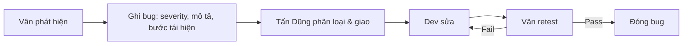

# 03 — Quy trình làm việc chung cho toàn dự án

> Áp dụng cho **cả 5 thành viên** trong suốt 5 sprint (05/10 → 15/11).
> Nguồn: `Nhóm LLM (1).pdf` + `Product_Backlog_5_Sprint.xlsx` (sheet "Ghi chú, giả định").

---

## 1. Quy ước Git

### 1.1 Nhánh

| Nhánh | Mục đích | Ai push |
|---|---|---|
| `main` | Nhánh chính, ổn định, deploy production | Chỉ merge qua PR |
| `develop` | Nhánh tích hợp, deploy staging | Chỉ merge qua PR |
| `feature/<mã-backlog>-<mô-tả>` | Tính năng mới | Từng thành viên |
| `fix/<mã-backlog>-<mô-tả>` | Sửa bug | Từng thành viên |
| `chore/<mô-tả>` | Việc nền tảng, cấu hình | Từng thành viên |

Ví dụ: `feature/US-21-api-key-service`, `fix/US-18-ssrf-block-private-ip`, `chore/EN-05-docker-compose`.

### 1.2 Commit message

```
<type>(<scope>): <mô tả ngắn>

[body tùy chọn]

Refs: <mã backlog>
```

| Type | Dùng khi |
|---|---|
| `feat` | Thêm tính năng |
| `fix` | Sửa bug |
| `docs` | Tài liệu |
| `refactor` | Tái cấu trúc, không đổi hành vi |
| `test` | Thêm/sửa test |
| `chore` | Cấu hình, build, CI |
| `perf` | Tối ưu hiệu năng |

Ví dụ: `feat(gateway): kiểm tra quota bằng Redis trước khi forward` — `Refs: US-23`

### 1.3 Pull Request

**Bắt buộc:**

1. PR nhỏ, một mục backlog chính
2. Mô tả: làm gì, mã backlog, cách test, ảnh chụp UI (nếu là FE)
3. **CI phải xanh** — PR không qua CI thì không được merge (EN-05)
4. Ít nhất **1 approval** — không tự merge PR của mình
5. Không còn dấu conflict Git, không còn khoảng trắng cuối dòng (script `kiem-tra-kho-ma-nguon.ps1` chặn)
6. `README.md` ở gốc phải tồn tại và không rỗng khi merge vào `main`

### 1.4 Bảo vệ nhánh

- `main` và `develop`: **cấm push trực tiếp**, chỉ merge qua PR.
- Bật required status check = job `ket-qua` của CI.

---

## 2. CI/CD

### 2.1 CI hiện có (`.github/workflows/ci.yml`)

Chạy khi: PR vào `main`/`develop`, push vào `main`/`develop`, hoặc thủ công.

| Job | Nội dung |
|---|---|
| `phat-hien` | Quét file cấu hình để phát hiện công nghệ (node, python, java, dotnet, go, rust, php, ruby, cmake) |
| `nen-tang` | Chạy `scripts/kiem-tra-kho-ma-nguon.ps1` trên `windows-latest` |
| `node` | `npm ci` → `npm run lint` → `npm test` → `npm run build` |
| `ket-qua` | Tổng hợp; **fail nếu có job fail/cancel** |

### 2.2 Script kiểm tra nền tảng

`scripts/kiem-tra-kho-ma-nguon.ps1` chặn:

- Dấu conflict Git chưa xử lý (`<<<<<<<`, `=======`, `>>>>>>>`)
- Khoảng trắng cuối dòng
- Thiếu hoặc rỗng `README.md` trên nhánh `main`

**Chạy local trước khi push:**

```powershell
./scripts/kiem-tra-kho-ma-nguon.ps1
```

### 2.3 CD

| Sprint | Môi trường | Kích hoạt |
|---|---|---|
| 2 (EN-08) | `staging` | Tự động khi merge vào nhánh chính |
| 5 (EN-13) | `production` | Thủ công, có rollback plan |

---

## 3. Quy ước code

### 3.1 Backend (Node.js + TypeScript + Express 5)

- Cấu trúc: `routes → controllers → services → repositories`
- **Validation** ở tầng route/controller; **nghiệp vụ** ở service; **truy vấn** ở repository
- **Format lỗi thống nhất** toàn hệ thống (EN-02):

```json
{
  "error": {
    "code": "FORBIDDEN",
    "message": "Bạn không có quyền truy cập chức năng này.",
    "details": []
  }
}
```

- **Logging** có cấu trúc; **redact** dữ liệu nhạy cảm trước khi ghi
- **Swagger/OpenAPI** cập nhật mỗi khi API đổi
- Mọi route nghiệp vụ có `authenticate` + `requireRole`

### 3.2 Frontend (React + TypeScript)

- **Design System** dùng chung: button, form, table, modal (EN-03)
- **API client** tập trung; tự làm mới token; route guard theo vai trò
- Mọi danh sách có **loading / error / empty state**
- **Responsive** mobile + desktop
- Không hardcode URL API — dùng biến môi trường

### 3.3 Database (PostgreSQL)

- **Mọi thay đổi schema đi qua migration** trong `migrations/`, đánh số tuần tự
- Quy tắc đặt tên bảng/cột thống nhất (Danh chốt ở Sprint 1)
- Có `constraint`, `foreign key`, `index` cho mọi quan hệ và truy vấn chính
- Migration phải chạy sạch **từ DB trống**
- Seed data tách riêng khỏi migration schema

### 3.4 Redis

- Chỉ dùng cho: rate limit counter, quota counter, sandbox counter
- Có tài liệu quy tắc **Redis ↔ PostgreSQL** và hành vi **fail-open / fail-closed** khi Redis lỗi (Sprint 4)

---

## 4. Quy trình QA & quản lý bug

### 4.1 Vòng đời bug



### 4.2 Mức độ bug

| Severity | Định nghĩa | Xử lý |
|---|---|---|
| **Critical** | Chặn demo, mất dữ liệu, lỗ hổng bảo mật | Sửa ngay |
| **High** | Sai chức năng chính, sai quyền | Sửa trong sprint |
| **Medium** | Sai nhỏ, ảnh hưởng UX | Sửa nếu còn năng lực |
| **Low** | Cosmetic | Có thể để sau |

**Điều kiện release:** **không còn bug Critical/High mở**.

### 4.3 Nguyên tắc test

- **Test chạy cuốn chiếu trong từng sprint**, không dồn về Sprint 5
- Bug Critical/High báo **ngay**, không chờ hết sprint
- **Đối soát số liệu** giữa Frontend ↔ Backend ↔ Database (đặc biệt Usage Dashboard vs Usage Log)
- Kiểm tra quyền cho **cả 3 vai trò** ở mọi màn hình mới

---

## 5. Nhịp sprint

| Sự kiện | Thời điểm | Kết quả |
|---|---|---|
| Sprint Planning | Ngày đầu sprint | Chốt mục backlog, effort, người làm |
| Daily standup | Hằng ngày | Block được phát hiện sớm |
| Sprint Review / Demo | Ngày cuối sprint | Chạy kịch bản demo |
| Retrospective | Sau Review | Cải tiến quy trình |

### 5.1 Lịch 5 sprint

| Sprint | Tên | Thời gian | Số ngày | Effort |
|---|---|---|---|---|
| 1 | Nền tảng & Tài khoản | 05/10 – 11/10 | 7 | 45 |
| 2 | Provider đăng và xuất bản API | 12/10 – 20/10 | 9 | 57 |
| 3 | Consumer tìm, thử và lấy API Key | 21/10 – 29/10 | 9 | 54 |
| 4 | Subscribe, Gateway kiểm soát & Usage | 30/10 – 09/11 | 11 | 67 |
| 5 | Hoàn thiện, bảo mật & sẵn sàng demo | 10/11 – 15/11 | 6 | 37 |

**Feature freeze: hết Sprint 4 (09/11).**

---

## 6. Bàn giao giữa các vai trò

| Từ | Đến | Bàn giao gì | Thời điểm |
|---|---|---|---|
| Danh | Tùng Dương | Schema + migration | Đầu sprint |
| Tùng Dương | Hải Dương | Swagger/API contract | Giữa sprint (nhận dần theo ngày) |
| Hải Dương | Tấn Dũng | Bộ component dùng chung | Sprint 1 |
| Tấn Dũng | Vân | Bản staging | Cuối sprint |
| Vân | Tấn Dũng | Danh sách bug | Trong 24h |
| Tấn Dũng | Vân | Bản production | Sprint 5 |

---

## 7. Checklist trước khi merge PR

- [ ] Đúng nhánh, đúng mã backlog
- [ ] CI xanh
- [ ] Có ít nhất 1 approval
- [ ] Không có dấu conflict Git
- [ ] Không có khoảng trắng cuối dòng
- [ ] Không commit secret (`.env`, key, token)
- [ ] Swagger/tài liệu đã cập nhật (nếu API đổi)
- [ ] Migration chạy sạch từ DB trống (nếu schema đổi)
- [ ] Có test cho phần thay đổi
- [ ] Không log dữ liệu nhạy cảm

---

## 8. Checklist release (Sprint 5)

- [ ] Không còn bug Critical/High mở
- [ ] Full Regression + Integration Test đạt
- [ ] UAT 3 vai trò đạt
- [ ] Security checklist hoàn tất
- [ ] Load test có số liệu (RPS, P95)
- [ ] Production migration chạy sạch
- [ ] Backup/restore đã thử khôi phục thành công
- [ ] Rollback plan đã chạy thử
- [ ] Test Report hoàn tất
- [ ] User Guide cho 3 vai trò
- [ ] Kịch bản demo chạy trọn vẹn không cần sửa tay
- [ ] Release Candidate được xác nhận

---

## Tài liệu liên quan

- [01-kien-truc-he-thong.md](./01-kien-truc-he-thong.md) — Kiến trúc hệ thống
- [02-role-va-phan-quyen.md](./02-role-va-phan-quyen.md) — Role & phân quyền