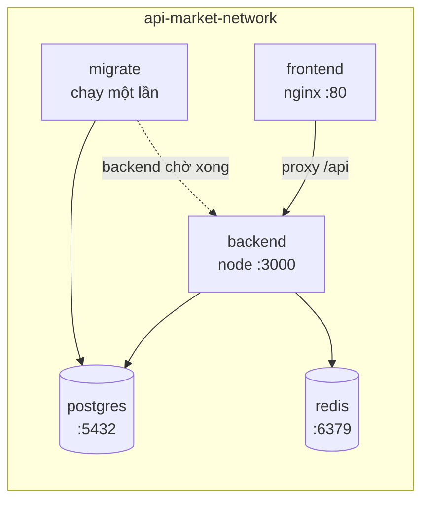

# Docker — EN-05

Một lệnh dựng cả hệ thống FE–BE–DB–Redis.

## Yêu cầu

- Docker Engine 24+ và Docker Compose v2 (`docker compose`, không phải `docker-compose`)
- Cổng trống: 3000 (backend), 5173 (frontend), 5432 (PostgreSQL), 6379 (Redis)

Kiểm tra:

```powershell
docker --version
docker compose version
```

## Chạy lần đầu

### 1. Tạo file môi trường

```powershell
Copy-Item .env.docker.example .env.docker
```

Mở `.env.docker` và **đổi `JWT_SECRET`** thành chuỗi ngẫu nhiên tối thiểu 32 byte:

```powershell
[Convert]::ToBase64String((1..32 | ForEach-Object { Get-Random -Max 256 }))
```

> Backend sẽ **từ chối khởi động** nếu `JWT_SECRET` còn là giá trị mẫu hoặc ngắn hơn 32 byte.

### 2. Dựng hệ thống

```powershell
docker compose --env-file .env.docker up --build -d
```

Lệnh này dựng **postgres**, **redis**, **migrate**, **backend** theo đúng thứ tự:

```
postgres + redis (healthy)  →  migrate (chạy xong)  →  backend
```

`migrate` tự chạy `001_create_auth_schema.sql` và tạo 3 role, sau đó container dừng. Backend chỉ khởi động khi migrate đã xong (`condition: service_completed_successfully`).

Frontend nằm sau profile riêng (xem mục Frontend).

### 3. Tạo tài khoản demo (tùy chọn)

```powershell
docker compose --env-file .env.docker run --rm migrate --seed
```

Chạy thêm `002_seed_auth_data.sql` tạo 3 tài khoản demo. **Chỉ dùng cho development** — bị chặn khi `NODE_ENV=production`.

> Migration **không** tự seed tài khoản demo. Phải gọi thủ công như trên.

### 4. Kiểm tra

| Dịch vụ | Địa chỉ |
|---|---|
| Backend health | http://localhost:3000/health |
| Swagger UI | http://localhost:3000/docs/ |
| OpenAPI JSON | http://localhost:3000/openapi.json |
| PostgreSQL | `localhost:5432` — db `api_market_dev` |
| Redis | `localhost:6379` |

Tài khoản demo sau khi seed:

| Email | Vai trò |
|---|---|
| `admin@example.com` | Admin |
| `user@example.com` | Consumer |
| `provider@example.com` | Provider |

Mật khẩu ghi trong `migrations/002_seed_auth_data.sql`.

## Frontend

Sprint 1 chưa có mã nguồn frontend (issue #3). Service `frontend` nằm sau profile `frontend` nên `docker compose up` **không** dựng nó — tránh lỗi build khi thư mục `frontend/` còn trống.

Khi frontend đã có mã nguồn:

```powershell
docker compose --env-file .env.docker --profile frontend up --build -d
```

Frontend chạy tại http://localhost:5173.

Cấu trúc `frontend/` cần có:

```
frontend/package.json
frontend/package-lock.json
frontend/vite.config.ts
frontend/index.html
frontend/src/...
```

`frontend/Dockerfile` và `frontend/nginx.conf` đã được viết sẵn, không cần sửa.

## Lệnh thường dùng

```powershell
# Xem trạng thái
docker compose --env-file .env.docker ps

# Xem log
docker compose --env-file .env.docker logs -f backend

# Dựng lại sau khi đổi code
docker compose --env-file .env.docker up --build -d

# Dừng (giữ dữ liệu)
docker compose --env-file .env.docker down

# Dừng và xóa toàn bộ dữ liệu
docker compose --env-file .env.docker down -v

# Vào PostgreSQL
docker compose --env-file .env.docker exec postgres psql -U postgres -d api_market_dev

# Vào Redis
docker compose --env-file .env.docker exec redis redis-cli

# Chạy test backend trong container
docker compose --env-file .env.docker run --rm --entrypoint sh backend -c "npm ci && npm test"
```

## Kiến trúc



| Service | Image | Vai trò |
|---|---|---|
| `postgres` | `postgres:17-alpine` | Dữ liệu lâu dài, volume `api-market-postgres-data` |
| `redis` | `redis:7-alpine` | Bộ đếm rate limit/quota (Sprint 4), volume `api-market-redis-data` |
| `migrate` | build từ `backend/Dockerfile.migrate` | Chạy migration/seed, chạy một lần rồi thoát |
| `backend` | build từ `backend/Dockerfile` | Control Plane API |
| `frontend` | build từ `frontend/Dockerfile` | React SPA qua nginx, profile `frontend` |

## Quyết định thiết kế

**`HOST=0.0.0.0` là bắt buộc.** Backend mặc định bind `127.0.0.1`, chỉ nghe trong container. Compose đặt `HOST=0.0.0.0` để cổng publish ra ngoài hoạt động.

**`DATABASE_URL` dùng tên service `postgres`, không phải `localhost`.** Trong mạng nội bộ của compose, các container gọi nhau bằng tên service.

**`migrate` chạy tự động khi `up`, nhưng không seed.** Migration là idempotent (có checksum + history + advisory lock) nên chạy lại an toàn. Seed tài khoản demo phải gọi thủ công để tránh tạo tài khoản có mật khẩu công khai ngoài ý muốn.

**Backend chờ migrate xong.** `depends_on: migrate: condition: service_completed_successfully` đảm bảo backend không khởi động khi schema chưa sẵn sàng.

**Backend image dùng multi-stage.** Tầng builder cài cả devDependency để biên dịch TypeScript; tầng runtime chỉ giữ production dependency. Image nhỏ hơn và ít bề mặt tấn công.

**Chạy bằng user `node`, không phải root.**

**`migrations/` được copy vào image.** `PostgresAuthStore` đọc file SQL lúc chạy qua đường dẫn `../../migrations` tính từ `dist/src/postgres-store.js`.

**Frontend nằm sau profile.** Sprint 1 chưa có mã nguồn frontend; nếu để mặc định thì `docker compose up` sẽ lỗi build.

**Healthcheck dùng `/health` có sẵn.** Backend và frontend đều có healthcheck; `depends_on` dùng `condition: service_healthy` nên thứ tự khởi động đúng.

## Xử lý sự cố

| Triệu chứng | Nguyên nhân | Cách sửa |
|---|---|---|
| `JWT_SECRET is required` | Chưa tạo `.env.docker` hoặc chưa truyền `--env-file` | `Copy-Item .env.docker.example .env.docker` rồi đổi `JWT_SECRET` |
| Backend khởi động rồi thoát | `JWT_SECRET` còn giá trị mẫu hoặc < 32 byte | Sinh secret ngẫu nhiên mới |
| `port is already allocated` | Cổng đang bị chiếm | Đổi `BACKEND_PORT` / `POSTGRES_PORT` trong `.env.docker` |
| Backend báo lỗi kết nối DB | `migrate` chưa chạy xong hoặc thất bại | `docker compose logs migrate` để xem lỗi |
| Đăng nhập báo sai tài khoản | Chưa seed | `docker compose run --rm migrate --seed` |
| Frontend build lỗi | Chưa có mã nguồn frontend | Bỏ qua, hoặc thêm mã nguồn rồi dùng `--profile frontend` |
| Muốn xóa sạch làm lại | Dữ liệu cũ còn trong volume | `docker compose down -v` |

## Ghi chú

- `.env.docker` đã được `.gitignore` bỏ qua. **Không commit file này.**
- Redis đã sẵn sàng nhưng Sprint 1 chưa dùng. Rate limiter hiện lưu trong bộ nhớ; Sprint 4 (US-23) sẽ chuyển sang Redis.
- Compose này dành cho **development**. Production (EN-13) cần cấu hình riêng: secret từ secret manager, không publish cổng DB/Redis, TLS.