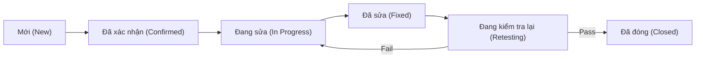

# Quy trình quản lý Bug — API Marketplace

Tài liệu này hướng dẫn cách ghi nhận, phân loại và xử lý lỗi (bug) trong suốt dự án.

---

## 1. Vòng đời của một Bug



1.  **New:** QA phát hiện lỗi và tạo Issue trên GitHub với label `bug`.
2.  **Confirmed:** Tech Lead (@antondung) xác nhận lỗi và giao cho Dev liên quan.
3.  **In Progress:** Dev đang thực hiện sửa lỗi.
4.  **Fixed:** Dev đã sửa xong, push code lên branch và yêu cầu QA kiểm tra lại.
5.  **Retesting:** QA thực hiện kiểm tra lại dựa trên các bước tái hiện lỗi.
6.  **Closed:** Lỗi đã được khắc phục hoàn toàn.

---

## 2. Phân loại mức độ nghiêm trọng (Severity)

| Mức độ | Định nghĩa | Ví dụ |
|---|---|---|
| **Critical** | Lỗi chặn hoàn toàn luồng nghiệp vụ chính, mất dữ liệu hoặc lỗi bảo mật nghiêm trọng. | Không thể đăng ký, lộ mật khẩu trong log, crash server. |
| **High** | Lỗi chức năng chính không hoạt động đúng AC, sai lệch quyền truy cập. | Consumer vào được trang Admin, không thể xóa API key. |
| **Medium** | Lỗi chức năng phụ hoặc lỗi UX gây khó khăn cho người dùng. | Tìm kiếm không chính xác, lỗi giao diện trên mobile. |
| **Low** | Lỗi nhỏ về thẩm mỹ, chính tả, không ảnh hưởng đến chức năng. | Sai lỗi chính tả, màu sắc nút chưa đúng design. |

---

## 3. Mẫu báo cáo Bug (Bug Report Template)

Khi tạo một Issue bug mới trên GitHub, hãy sử dụng mẫu sau để Dev dễ dàng tái hiện:

```markdown
## [BUG] <Tóm tắt lỗi ngắn gọn và rõ ràng>

**Mã Backlog liên quan:** US-XX

### 1. Mô tả lỗi
<Mô tả chi tiết về hành vi sai lệch của hệ thống>

### 2. Các bước tái hiện (Steps to Reproduce)
1. Truy cập vào trang...
2. Nhấn vào nút...
3. Nhập dữ liệu...
4. Quan sát kết quả...

### 3. Kết quả mong đợi (Expected Result)
<Hệ thống nên hoạt động như thế nào?>

### 4. Kết quả thực tế (Actual Result)
<Hệ thống thực tế đang bị gì?>

### 5. Thông tin bổ sung
- **Severity:** Critical / High / Medium / Low
- **Môi trường:** Chrome v120 / Windows 11
- **Ảnh chụp/Video:** (Nếu có, hãy đính kèm ở đây)
- **Log API:** (Copy paste nội dung lỗi từ Console hoặc Network tab nếu có)
```

---

## 4. Quy tắc "Bàn giao"

- QA (@vuonghathaovan-gif) báo bug ngay khi phát hiện, không chờ cuối sprint.
- Bug **Critical & High** phải được ưu tiên sửa trước khi merge PR vào `develop`.
- Mọi bug khi đóng (`Closed`) phải có ghi chú từ QA xác nhận đã pass trên môi trường nào.
